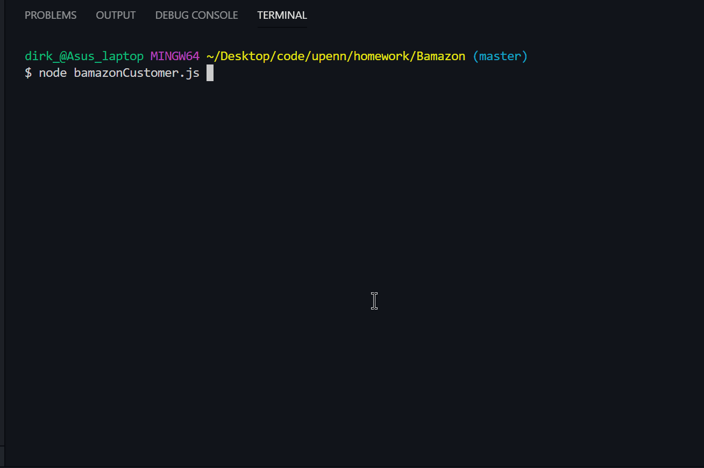

# Bamazon

## Setup - MySQL/MAMP
1. You will need to have a MySQL server running to use this app. MAMP is free software that runs a MySQL server on your local machine. Their URL can be found in the Technologies Used section below. Once you have a MySQL server running, take note of the `host`, `port`, `user` and `password` info on the server. On MAMP, this can be accessed clicking on the `open start page` icon on the MAMP app. 

2. Install and configure the MySQL database app. For `MySQL Workbench`, on the start screen, click on the add or edit icons next to `MySQL Connections` and check that the settings correspond to the MAMP settings. The password is normally `root`. Once the settings are entered, click the `Test Connection` button to confirm that the connection is working.  

## Setup - Database:
1. Open the code for `bamazon_schema.sql` in your text editor, copy it, and paste it into the Query window of `MySQL Workbench`.

2. Click the leftmost lightning-bolt icon (to the right of the disk icon), or select Query - Execute (All or Selection) in the Workbench menu. This will create the schema (skeleton) for the database.

3. Then click on the refresh icon at the top right side of the SCHEMAS panel to confirm that the database was created. It should be called bamazon_db. Click on the dropdown arrows of the database and confirm that the database was created, and that it has a table named `products` with a number of columns.

4. Delete the existing code and paste in the contents of the `bamazon_seeds.sql` file. This will import the data into the database. Click the left-most lighting bolt and click the refresh. expand the tables, and select the product table. Three small black icons will appear to the right. Click the right-most one, which looks like a small spreadsheet with a lightning bolt in the corner. This will display a preview of the database. Confirm that the database was created. You can also check the Output window on the bottom for any error messsages.

## Setup - Node, NPM, and bamazonCustomer JavaScript file
1. If not installed already, download & install `Node.js` on your computer: https://nodejs.org/en/

2. Copy the files to the directory you wish to run bamazon from. You will only need to copy the following files: `bamazon_schema.sql, bamazon_seeds.sql, bamazonCustomer,js, package-lock.json,` and `package.json`. The gifs and images folders are for the readme file and are not needed.  

3. At the command line in the directory where the LIRI files are located, type `npm i` - this will read the `package.json` file and install any needed packages. They will be installed in a node_modules folder.

4. Open `bamazonCustomer.js` in a text editor and change the connection info as needed to match the settings in your MySQL server and save it. 

## How to use Bamazon:
1. Navigate in the command line to the directory where the Bamazon files are located. Type `node bamazonCustomer` at the prompt.
2. Select the item id for the product you wish to buy, and then the quantity desired. If you order more than what is available in inventory, the order will not go through and you will get a notification. If the order is successful, you will get a confirmation message with the total price of your order.
3. To quit Bamazon, just type `y` at the prompt and Bamazon will exit.

## Bamazon Demo

## Technologies used:
* JavaScript
* Node.js - https://nodejs.org
* MySQL Workbench - https://www.mysql.com/products/workbench/
* MAMP local server - https://www.mamp.info/en/
* console.table NPM package (for formatting console output) - https://www.npmjs.com/package/console.table